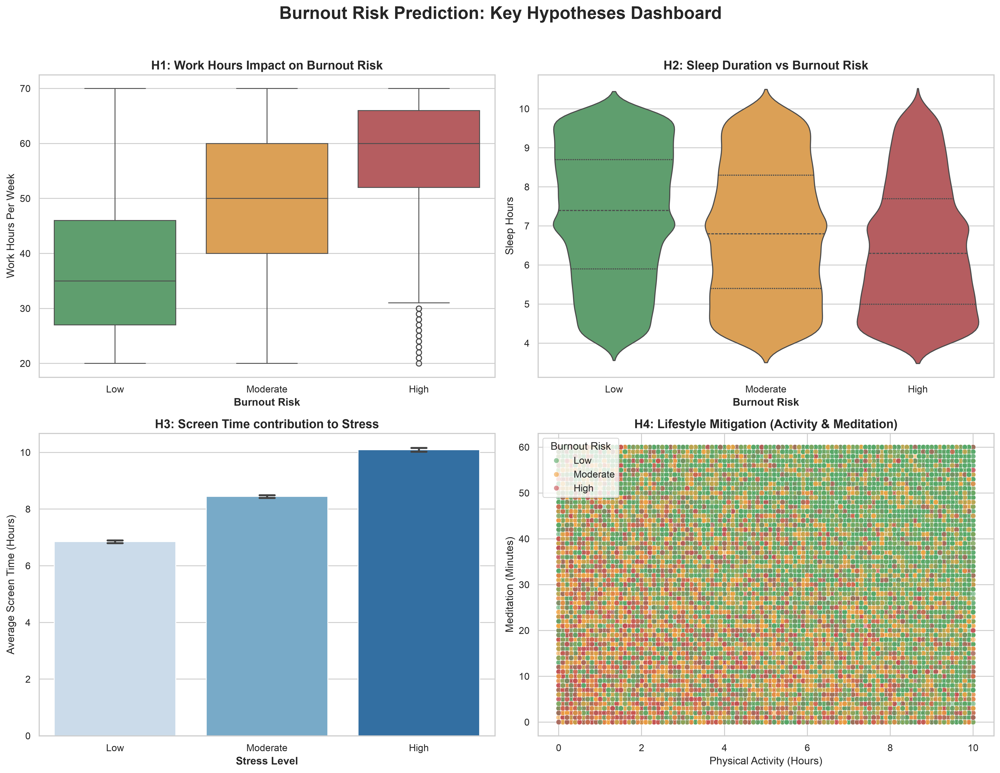
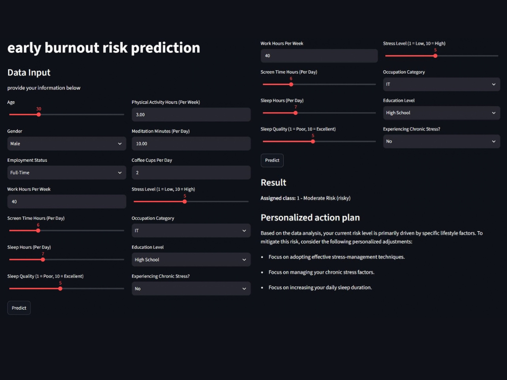
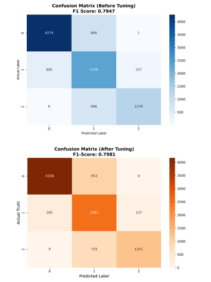

# End-to-end Burnout Risk Assessment

End-to-End Machine Learning web application for predicting **burnout risk levels** from approximately 16 features extracted from a structured dataset, with model interpretation and personalized recommendations.

The project covers the complete machine learning workflow, from data preprocessing and exploratory data analysis to model training, evaluation, explainability, and deployment with Streamlit.

[](https://www.hcmus.edu.vn/)
[](https://www.python.org/)
[](https://pandas.pydata.org/)
[](https://scikit-learn.org/)
[](https://scikit-learn.org/stable/modules/ensemble.html#random-forests)
[](https://shap.readthedocs.io/)
[](https://streamlit.io/)
[](https://www.kaggle.com/)
[](https://scikit-learn.org/)

> **DISCLAIMER:** This project is intended for educational and personal portfolio purposes only. It is **NOT** a medical diagnostic tool and should **NOT** be used as a substitute for professional medical advice, diagnosis, or treatment.

---

## Demo







---

## Project Overview

Burnout can be influenced by multiple factors related to workload, sleep, lifestyle, stress, and other personal circumstances.

This project explores whether machine learning can be used to identify patterns associated with different levels of burnout risk and turn those predictions into an interactive application.

The goal is not to diagnose burnout, but to demonstrate an **end-to-end machine learning workflow** and explore how model predictions can be made more interpretable and useful to users.

---

## Machine Learning Pipeline

```text
Raw Dataset
     │
     ▼
Data Cleaning & Preprocessing
     │
     ▼
Exploratory Data Analysis
     │
     ▼
Feature Selection / Engineering
     │
     ▼
Train / Test Split
     │
     ▼
Random Forest Classifier
     │
     ▼
Model Evaluation
     │
     ▼
SHAP Model Explainability
     │
     ▼
Personalized Recommendations
     │
     ▼
Streamlit Web Application
```

---

## Features

The application uses approximately 16 features extracted from the dataset.

Depending on the dataset, these features may represent factors related to areas such as:

* Sleep and rest
* Work or study workload
* Stress
* Lifestyle
* Daily habits
* Personal circumstances

The exact features and preprocessing steps are documented in the project notebooks and source code.

---

## Tech Stack

| Technology        | Purpose                                       |
| ----------------- | --------------------------------------------- |
| **Python**        | Main programming language                     |
| **Pandas**        | Data loading, cleaning, and manipulation      |
| **Matplotlib**    | Data visualization                            |
| **Seaborn**       | Exploratory data visualization                |
| **Scikit-learn**  | Preprocessing, model training, and evaluation |
| **Random Forest** | Main machine learning model                   |
| **SHAP**          | Model explainability                          |
| **Streamlit**     | Interactive web application                   |

---

## Model

The project uses a **Random Forest Classifier** to predict burnout risk levels.

Random Forest was selected as the main model because it can capture non-linear relationships between features while providing useful feature importance information. Its tree-based structure also works well with a mixture of numerical and categorical features after appropriate preprocessing.

The trained model is saved and loaded by the Streamlit application so that predictions can be made without retraining the model every time the application starts.

---

## Model Explainability

To make the predictions more interpretable, the project uses **SHAP (SHapley Additive exPlanations)**.

SHAP is used to investigate which features contribute to individual predictions and to provide insight into how different inputs influence the model's output.

This helps move the application beyond simply returning:

```text
Assigned class: 0 / 1 / 2 - ___
```

and toward providing information about **why the model produced that prediction**.

---

## Personalized Recommendations

Based on the user's predicted risk level and relevant input features, the application provides personalized suggestions related to areas such as:

* Sleep and recovery
* Work/study workload
* Stress management
* Daily habits
* Work-life balance

These recommendations are intended as general wellness suggestions rather than medical advice.

---

## Exploratory Data Analysis

The project includes exploratory analysis of the dataset using Pandas, Matplotlib, and Seaborn.

The analysis focuses on:

* Feature distributions
* Relationships between variables
* Correlations
* Class distributions
* Potential patterns associated with burnout risk
* Data quality and missing values

Example visualizations are included in the project notebooks.

---

## Running Locally

### 1. Clone the repository

```bash
git clone https://github.com/kevinph4n/burnout-risk-prediction.git
cd burnout-risk-prediction
```

### 2. Create a virtual environment

```bash
python -m venv .venv
```

Activate it on Windows:

```bash
.venv\Scripts\activate
```

### 3. Install dependencies

```bash
pip install -r requirements.txt
```

### 4. Run the Streamlit application

```bash
streamlit run app.py
```

The application will then be available locally in your browser.

---

## Limitations

This project has several limitations:

* The model's performance depends heavily on the quality and representativeness of the dataset.
* Predictions are statistical outputs rather than clinical assessments.
* Self-reported data may contain bias or measurement error.
* The model may not generalize well to populations that differ from the original dataset.
* Personalized recommendations are rule/model-based suggestions and are not professional medical advice.

---

## Future Improvements

Possible future improvements include:

* Hyperparameter tuning and cross-validation
* Comparing Random Forest with other classification models
* Improved feature engineering
* More robust handling of class imbalance
* Better calibration of predicted probabilities
* More detailed SHAP-based explanations
* Improved recommendation logic
* Database integration for storing user sessions
* Cloud deployment
* Improved UI/UX

---

## Learning Goals

This project was built as a practical exercise in applying the concepts of an **end-to-end machine learning workflow**, including:

* Data preprocessing
* Exploratory Data Analysis
* Feature engineering
* Supervised machine learning
* Model evaluation
* Model interpretability
* Saving and loading trained models
* Building ML applications
* Deploying models through Streamlit

---

## Disclaimer

This project is created for **educational and personal portfolio purposes**.

The predictions and recommendations provided by the application are not medical diagnoses and should not be used to make healthcare decisions. If someone is concerned about their wellbeing or experiences persistent symptoms, they should seek advice from a qualified healthcare professional.

